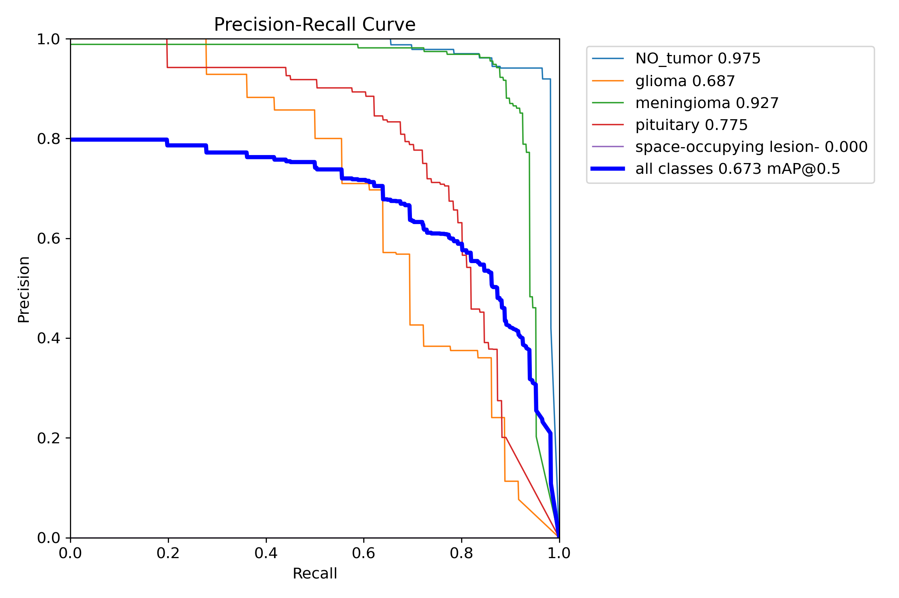

## Introduction

This is a front-end system for brain tumor detection based on YOLOv11 model.

### 🔧 Features

+ 📁 **Multiple File Upload**

  Support uploading and processing multiple medical images in one session.

+ 🧠 **Brain Tumor Detection Visualization**

  Automatically highlights predicted tumor regions with bounding boxes, showing the tumor type and confidence score. Users can zoom in on images for detailed inspection.

+ ⚙️ **Customizable Detection Parameters**

  Allows users to set the confidence threshold and Intersection over Union (IoU) threshold to adjust the sensitivity and precision of the detection results.

+ 🕒 **Detection History Management**

  Keeps a detailed log of all previous detection results. Users can browse, export, or delete historical records as needed.

+ 🌐 **Multilingual Interface (Chinese & English)**

  Provides an easy switch between Chinese and English interfaces to accommodate different language preferences.

+ 🎨 **Theme Switching Support**

  Offers light and dark mode options to enhance visual comfort based on user preference.

### Demo Video

https://github.com/user-attachments/assets/64ec5a6e-f4ee-413b-a1af-9e178e04b223

## Model Performance

| Model                                                                                               | $mAP50$    | $AP_{No\ tumor}50$ | $AP_{glioma}50$ | $AP_{meningioma}50$ | $AP_{pituitary}50$ | $AP_{space-occupying\ lesion}50$ |
|-----------------------------------------------------------------------------------------------------|------------|--------------------|-----------------|---------------------|--------------------|----------------------------------|
| [Baseline](https://universe.roboflow.com/brain-tumor-detection-wsera/tumor-detection-ko5jp/model/3) | 65.0%      | **98%​**           | 53%​            | **94%​**            | **80%​**           | 0%​                              |
| Ours                                                                                                | **67.3%​** | 97.5%​             | **68.7%​**      | 92.7%               | 77.5%​             | 0%​                              |



## Project Structure

```text
Brain-Tumor-Detection/
|
├── static/
|   ├── css/
|   |   ├── auth.css
|   |   ├── sidebar.css
|   |   └── styles.css
|   |
|   ├── images/
|   |   └── icons/
|   |
|   ├── js/
|   |   ├── app.js
|   |   ├── i18n.js
|   |   ├── language.js
|   |   ├── theme.js
|   |   └── verify.js 
|   |
|   └── results/  
|
├── templates/
|   ├── index.html
|   ├── login.html
|   └── register.html
|
├── app.py
├── archive.yaml
├── yolo.py
└── yolo11l.pt        
```
